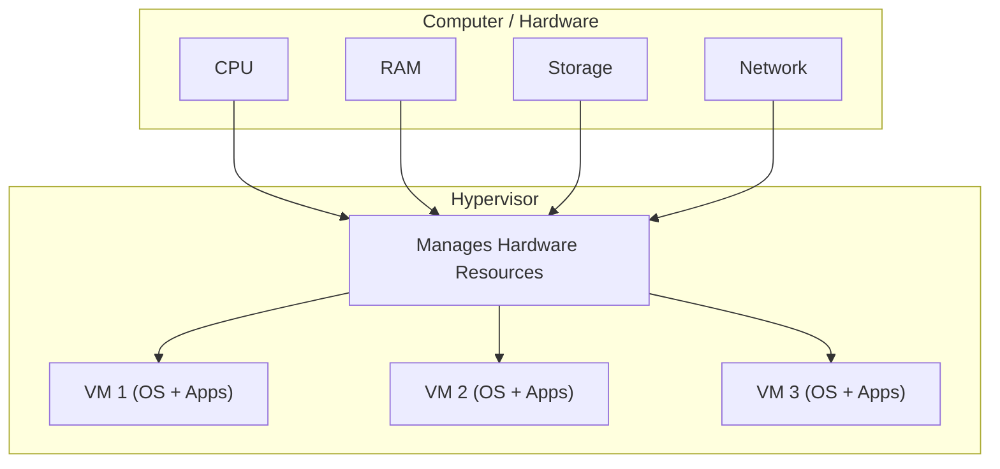
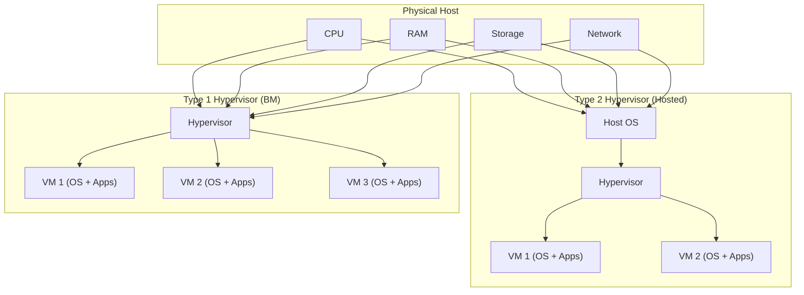
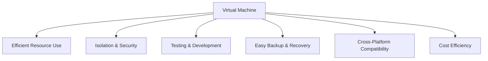
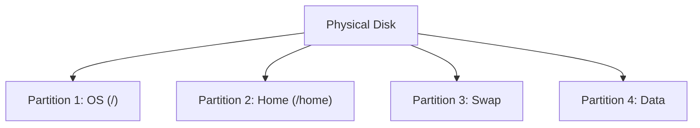
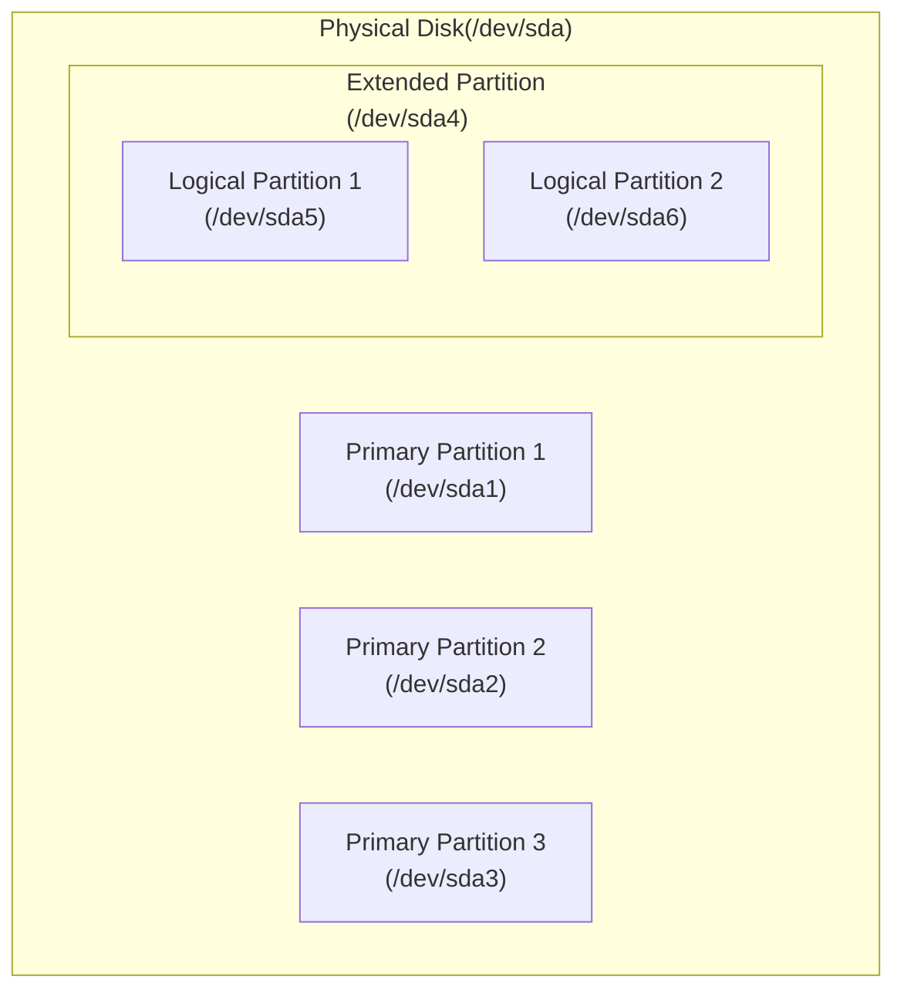
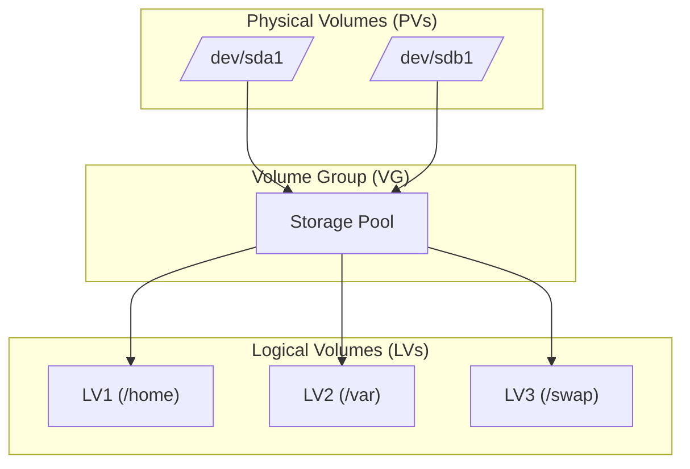

# 🧩 What is Virtualization?

Virtualization is a technology that allows you to create virtual versions of computer resources such as servers, operating systems, storage devices, or networks all running on a single physical machine.

In simple terms, it lets one physical computer act like many separate computers.

# 💻 What is a Virtual Machine?

A **Virtual Machine (VM)** is a software-based computer that runs **inside a physical computer**. It behaves like a real computer, with its own **operating system, applications, and resources**, but it shares the hardware of the host machine.

VMs are created using **virtualization software** (like VirtualBox, VMware, or KVM) and allow you to:

* Run multiple operating systems on a single physical machine
* Test and develop software in isolated environments
* Save resources by sharing CPU, memory, and storage efficiently

> Example: If your physical machine runs Linux, you can create a VM that runs Windows or another Linux version, without affecting the host system.



### Explanation of Diagram:
* The Physical Host is your real computer with CPU, RAM, storage, and network.
* The Hypervisor creates and manages multiple Virtual Machines (VMs).
* Each VM has its own OS and applications but shares the hardware resources through the hypervisor.
* VMs act like independent computers, even though they’re all running on one physical machine.

# ⚙️ How a Virtual Machine (VM) Works?

A **Virtual Machine (VM)** is a software-based computer that behaves like a real computer, but runs **inside a physical host machine**. It works by using a **hypervisor**, which is software that manages the physical hardware and allocates resources (CPU, memory, storage, network) to the VMs.

#### Step-by-Step Process:

1. **Hypervisor Installation:**

   * Type 1 (bare-metal): Hypervisor runs directly on the hardware.
   * Type 2 (hosted): Hypervisor runs on top of a host OS.

2. **VM Creation:**

   * Each VM gets **virtual hardware**: CPU, RAM, storage, and network adapters.

3. **OS Installation:**

   * You install an operating system inside the VM, just like on a physical computer.

4. **Resource Management:**

   * The hypervisor allocates physical resources to the VMs and ensures isolation between them.

5. **Execution:**

   * The VM runs applications and processes in its virtual environment without affecting the host or other VMs.

> **Key Idea:** The VM **acts like a real computer**, but the physical resources are shared and controlled by the hypervisor.



**Explanation of Diagram:**

* **Type 1:** Hypervisor (Bare-Metal) sits directly on the physical hardware; VMs run on top of it.
* **Type 2:** Hypervisor (Hosted) sits on the host OS; VMs run on top of the hypervisor.
* Physical resources (CPU, RAM, Storage, Network) are shared by the VMs through the hypervisor.

# 🎯 Purpose of Virtual Machines (VMs)

A **Virtual Machine (VM)** is created to provide a **flexible, isolated, and efficient computing environment**. Its main purposes are:

1. **Resource Optimization:**

   * Run multiple VMs on a single physical machine to make better use of CPU, RAM, and storage.

2. **Isolation and Security:**

   * Each VM is isolated from others, so problems (like crashes or malware) in one VM do **not affect others**.

3. **Testing and Development:**

   * Developers can test different operating systems, software, or configurations **without affecting the main system**.

4. **Simplified Backup and Recovery:**

   * VMs can be **snapshotted** or cloned easily, allowing quick recovery if something goes wrong.

5. **Cross-Platform Compatibility:**

   * Run software designed for one OS (like Windows) on a host with a different OS (like Linux or macOS).

6. **Cost Efficiency:**

   * Fewer physical machines are needed, saving **hardware, energy, and maintenance costs**.

### Purpose of VMs



This diagram and explanation make it **clear why VMs are widely used in modern IT, development, and cloud computing**.

# 🐧 What is the Basic Difference Between Rocky and Debian?

| Feature                            | **Rocky Linux**                                          | **Debian**                                                               |
| ---------------------------------- | -------------------------------------------------------- | ------------------------------------------------------------------------ |
| **Type**                           | Enterprise-focused Linux                                 | General-purpose Linux                                                    |
| **Origin**                         | Community-driven fork of RHEL (Red Hat Enterprise Linux) | Independent Linux distribution                                           |
| **Package Management**             | **RPM** packages with **dnf/yum**                        | **DEB** packages with **apt**                                            |
| **Release Model**                  | Stable, enterprise releases (long-term support)          | Stable releases + rolling updates (Debian Stable, Testing, Unstable)     |
| **Target Users**                   | Enterprises, servers, production environments            | General users, servers, desktops, developers                             |
| **Default Init System**            | **systemd**                                              | **systemd** (since Debian 8, previously SysVinit)                        |
| **Community / Commercial Support** | Community-driven, closely compatible with RHEL           | Large community support; used as base for Ubuntu and other distributions |
| **Use Case Example**               | Production servers, cloud environments                   | Desktops, servers, development, education                                |

### Summary in Simple Terms

* **Rocky Linux** = Enterprise-focused, RHEL-compatible, stable for production servers.
* **Debian** = Versatile, stable, widely used for servers and desktops, base for many other distributions.

# What is AppArmor, what's the difference between apt and apptitude?

### What is AppArmor?

**AppArmor** (Application Armor) is a **Linux security module** that helps protect your system by **restricting what applications can do**.

* It works by **enforcing security profiles** for each application.
* Profiles define which files, directories, and capabilities an application can access.
* If an application tries to do something outside its profile, AppArmor **blocks it**, helping prevent damage from bugs or attacks.

**Key Points:**

* Mandatory access control (MAC) system
* Easier to configure than some alternatives (like SELinux)
* Protects against malicious or misbehaving applications

### Difference Between `apt` and `aptitude`

Both `apt` and `aptitude` are **package management tools** used in Debian-based systems, but they have differences:

| Feature                   | **apt**                                                                     | **aptitude**                                                                           |
| ------------------------- | --------------------------------------------------------------------------- | -------------------------------------------------------------------------------------- |
| **Type**                  | Command-line tool for package management                                    | Command-line tool with optional text-based GUI                                         |
| **User Interface**        | CLI only                                                                    | CLI + interactive interface (`aptitude`)                                               |
| **Dependency Resolution** | Resolves dependencies automatically, sometimes asks for manual confirmation | More advanced dependency resolver; can suggest multiple solutions when conflicts occur |
| **Commands**              | `apt install package`, `apt remove package`, `apt update`                   | `aptitude install package`, `aptitude remove package`, `aptitude update`               |
| **Use Case**              | Quick, simple package management                                            | Complex dependency problems, easier package browsing and conflict resolution           |

**In short:**

* `apt` = modern, simple, fast CLI tool for most use cases.
* `aptitude` = advanced tool for handling tricky dependency issues and browsing packages interactively.

# What are partitions, what's their purpose and how to set them up
### What Are Partitions?

A **partition** is a **divided section of a physical storage device** (like a hard disk or SSD) that the operating system treats as a separate “logical” disk.

* A single disk can have **multiple partitions**.
* Each partition can have its own **file system** (ext4, NTFS, FAT32, etc.).
* Partitions help organize data and separate the operating system from user data.

### Purpose of Partitions

Partitions are used to:

1. **Separate System and User Data:**

   * For example, one partition for the OS (`/`) and another for user files (`/home`).

2. **Support Multiple Operating Systems:**

   * Each OS can be installed on a separate partition.

3. **Improve Performance:**

   * Disk operations can be optimized when data is organized into partitions.

4. **Enhance Security and Stability:**

   * If one partition fills up or crashes, other partitions remain unaffected.

5. **Enable Swap Space:**

   * A dedicated swap partition acts as virtual memory when RAM is full.

### How to Set Up Partitions

Partitions can be created during OS installation or on an existing disk using tools like **fdisk, gdisk, parted, or GParted**.

**Steps using `fdisk` (Linux CLI example):**

1. **List Disks:**

   ```bash
   sudo fdisk -l
   ```

2. **Select Disk to Partition:**

   ```bash
   sudo fdisk /dev/sdX
   ```

3. **Create a New Partition:**

   * Type `n` for a new partition.
   * Choose partition type (primary or extended).
   * Set start and end sectors (or accept defaults).

4. **Write Changes:**

   * Type `w` to save changes to the disk.

5. **Format Partition:**

   ```bash
   sudo mkfs.ext4 /dev/sdX1
   ```

6. **Mount Partition:**

   ```bash
   sudo mount /dev/sdX1 /mnt
   ```

Add to `/etc/fstab` to mount automatically at boot.



**Explanation:**

* One disk can have multiple partitions.
* Each partition can have a separate purpose (OS, user data, swap, backup).

# How to View the Partitions of the Machine

You can view all the **partitions and disks** on your system using different **Linux commands** or tools.
These show details like disk size, partition type, mount points, and file systems.

#### 🧭 1. Using `lsblk` (Recommended)

```bash
lsblk
```

**Description:**

* Lists all block devices (disks and partitions) in a **tree view**.
* Shows device names, sizes, and mount points.

**Example Output:**

```
NAME   MAJ:MIN RM  SIZE RO TYPE MOUNTPOINT
sda      8:0    0  100G  0 disk
├─sda1   8:1    0   50G  0 part /
├─sda2   8:2    0   45G  0 part /home
└─sda3   8:3    0    5G  0 part [SWAP]
```

#### 🧩 2. Using `fdisk`

```bash
sudo fdisk -l
```

**Description:**

* Displays **detailed information** about all disks and partitions (size, type, filesystem).
* Requires root privileges.

**Example Output:**

```
Device     Boot   Start      End  Sectors  Size Id Type
/dev/sda1  *       2048 1026047  1024000  500M 83 Linux
/dev/sda2       1026048 2097151  1071104  524M 82 Linux swap
```

#### 🧱 3. Using `parted`

```bash
sudo parted -l
```

**Description:**

* Lists partitions and details like partition table type (GPT/MBR).
* Useful for working with large modern disks.

#### 📊 4. Using `df -h`

```bash
df -h
```

**Description:**

* Shows **mounted partitions**, their usage, and available space in human-readable form.

**Example Output:**

```
Filesystem      Size  Used Avail Use% Mounted on
/dev/sda1        50G   20G   30G  40% /
/dev/sda2        45G   10G   35G  22% /home
```

### 🧠 Summary

| Command     | Purpose                             | Needs Root? | Notes             |
| ----------- | ----------------------------------- | ----------- | ----------------- |
| `lsblk`     | Show disks & partitions (tree view) | No          | Most common       |
| `fdisk -l`  | Detailed partition info             | ✅ Yes       | Classic tool      |
| `parted -l` | GPT/MBR details                     | ✅ Yes       | For modern setups |
| `df -h`     | Mounted partitions & usage          | No          | Shows disk usage  |

# What Are Primary and Logical Partitions?

A **partition** is a section of your physical storage device (like `/dev/sda`) that acts as a separate “container” for data or an operating system.
There are **two main types** of partitions in traditional **MBR (Master Boot Record)** partitioning: **Primary** and **Logical**.

### 🧩 Primary Partition

* A **primary partition** is one of the **main partitions** on a disk.
* The **MBR partition table supports up to 4 primary partitions** only.
* One of these primary partitions can be marked as **active (bootable)** — that’s where the operating system usually starts from.
* You **cannot create more than 4 primary partitions** on an MBR disk.

**Example:**
`/dev/sda1`, `/dev/sda2`, `/dev/sda3`, `/dev/sda4`

### 🧱 Logical Partition

* A **logical partition** exists **inside an extended partition** (a special type of primary partition).
* Used to **bypass the 4-partition limit** of MBR.
* You can create **many logical partitions** (like `/dev/sda5`, `/dev/sda6`, etc.).
* Logical partitions are mainly used for **data storage**, **swap**, or **extra OS installations**.

**Example:**

* `/dev/sda1` – Primary (OS)
* `/dev/sda2` – Extended

  * `/dev/sda5` – Logical
  * `/dev/sda6` – Logical

### ⚖️ Differences Between Primary and Logical Partitions

| Feature                  | **Primary Partition**           | **Logical Partition**                    |
| ------------------------ | ------------------------------- | ---------------------------------------- |
| **Maximum Number (MBR)** | Up to 4                         | Unlimited (inside an extended partition) |
| **Bootable**             | Yes (one can be active)         | No (cannot boot directly)                |
| **Location**             | Created directly on disk        | Inside an extended partition             |
| **Typical Use**          | Operating system or boot loader | Extra storage, swap, or additional OS    |
| **Partition Names**      | `/dev/sda1` to `/dev/sda4`      | `/dev/sda5` and above                    |

### 🧠 Modern Note

With modern **GPT (GUID Partition Table)** systems (used by UEFI), the limitation of 4 primary partitions no longer exists —
you can create **up to 128 partitions** directly, and the concept of “logical” partitions is obsolete.



**Explanation:**

* The disk can have up to 4 primary partitions.
* If you need more, one primary is turned into an **extended partition** containing multiple **logical partitions**.

# How LVM works and what it is all about?

### 🧱 What is LVM?

**LVM** stands for **Logical Volume Manager**.
It’s a system for managing disk storage in a **flexible and powerful** way — better than traditional fixed partitions.

Instead of dividing a disk into rigid partitions, LVM allows you to create **logical volumes** that can be **resized, moved, or combined** easily — even while the system is running.

### ⚙️ How LVM Works

LVM introduces **three main layers**:

1. **Physical Volumes (PVs):**

   * These are the actual physical storage devices — like `/dev/sda1`, `/dev/sdb1`, etc.
   * Each PV is initialized with LVM to be used in a volume group.

2. **Volume Groups (VGs):**

   * A volume group is a **pool of storage** created by combining one or more physical volumes.
   * Think of it like a big container made up of multiple disks.

3. **Logical Volumes (LVs):**

   * From the volume group, you create **logical volumes**, which act like virtual partitions.
   * You can format them with a filesystem and mount them like normal disks (e.g., `/home`, `/var`).

### 🧩 Example Workflow

1. You have two disks: `/dev/sda1` and `/dev/sdb1`
2. You convert them into **Physical Volumes (PVs)** using:

   ```bash
   sudo pvcreate /dev/sda1 /dev/sdb1
   ```
3. Combine them into a **Volume Group (VG)**:

   ```bash
   sudo vgcreate vg_data /dev/sda1 /dev/sdb1
   ```
4. Create a **Logical Volume (LV)** inside that VG:

   ```bash
   sudo lvcreate -L 50G -n lv_storage vg_data
   ```
5. Format and mount it:

   ```bash
   sudo mkfs.ext4 /dev/vg_data/lv_storage
   sudo mount /dev/vg_data/lv_storage /mnt/storage
   ```

✅ Now you have one big flexible “virtual disk” that spans multiple physical drives.

### 🪄 Advantages of LVM

| Feature                | Description                                         |
| ---------------------- | --------------------------------------------------- |
| **Flexibility**        | Resize logical volumes easily (extend or shrink).   |
| **Scalability**        | Combine multiple disks into one large storage pool. |
| **Snapshots**          | Create instant backups of live systems.             |
| **Dynamic Management** | Add or remove physical disks without downtime.      |



**Explanation:**

* Physical volumes (`/dev/sda1`, `/dev/sdb1`) form the base.
* They are grouped into a **Volume Group (VG)**, which acts as a big storage pool.
* From this pool, you create **Logical Volumes (LVs)** that behave like partitions.

