# 🖥️ Born2beRoot

> Because managing a server is more than just typing commands 😉

## 📘 Introduction

The **Born2beRoot** project is about **setting up and configuring a Linux server from scratch**.
It teaches you how to manage **users, groups, partitions, services, and essential system tools** while understanding **Linux internals**.

Once completed, you’ll have a fully functional server ready to host applications or services
and you’ll gain a deep understanding of **Linux system administration and server management**.

## 🧠 Purpose

* Learn to **create and manage users and groups** efficiently.
* Understand **partitions, logical volumes (LVM), and storage management**.
* Configure **essential services** like web servers, databases, and PHP.
* Master **security tools** like SSH, UFW, and cron scheduling.
* Build a **robust, flexible server environment** ready for production or personal projects.

# 🧩 What is Virtualization?

Virtualization is a technology that allows you to create virtual versions of computer resources such as servers, operating systems, storage devices, or networks all running on a single physical machine.

In simple terms, it lets one physical computer act like many separate computers.

# 💻 What is a Virtual Machine?

A **Virtual Machine (VM)** is a software-based computer that runs **inside a physical computer**. It behaves like a real computer, with its own **operating system, applications, and resources**, but it shares the hardware of the host machine.

VMs are created using **virtualization software** (like VirtualBox, VMware, or KVM) and allow you to:

* Run multiple operating systems on a single physical machine
* Test and develop software in isolated environments
* Save resources by sharing CPU, memory, and storage efficiently

> Example: If your physical machine runs Linux, you can create a VM that runs Windows or another Linux version, without affecting the host system.

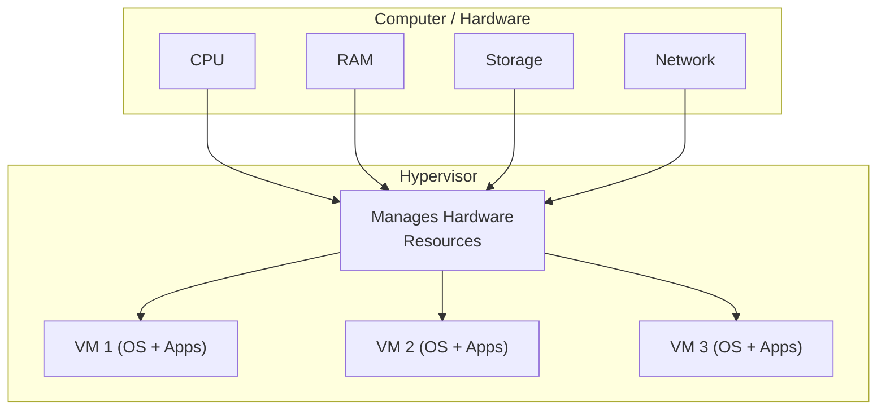

### Explanation of Diagram:
* The Physical Host is your real computer with CPU, RAM, storage, and network.
* The Hypervisor creates and manages multiple Virtual Machines (VMs).
* Each VM has its own OS and applications but shares the hardware resources through the hypervisor.
* VMs act like independent computers, even though they’re all running on one physical machine.

# ⚙️ How a Virtual Machine (VM) Works?

A **Virtual Machine (VM)** is a software-based computer that behaves like a real computer, but runs **inside a physical host machine**. It works by using a **hypervisor**, which is software that manages the physical hardware and allocates resources (CPU, memory, storage, network) to the VMs.

#### Step-by-Step Process:

1. **Hypervisor Installation:**

   * Type 1 (bare-metal): Hypervisor runs directly on the hardware.
   * Type 2 (hosted): Hypervisor runs on top of a host OS.

2. **VM Creation:**

   * Each VM gets **virtual hardware**: CPU, RAM, storage, and network adapters.

3. **OS Installation:**

   * You install an operating system inside the VM, just like on a physical computer.

4. **Resource Management:**

   * The hypervisor allocates physical resources to the VMs and ensures isolation between them.

5. **Execution:**

   * The VM runs applications and processes in its virtual environment without affecting the host or other VMs.

> **Key Idea:** The VM **acts like a real computer**, but the physical resources are shared and controlled by the hypervisor.

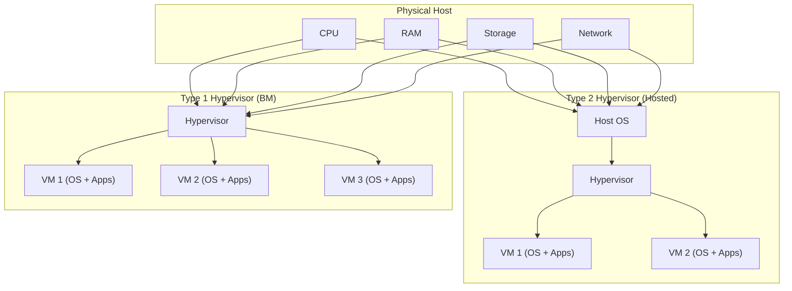

**Explanation of Diagram:**

* **Type 1:** Hypervisor (Bare-Metal) sits directly on the physical hardware; VMs run on top of it.
* **Type 2:** Hypervisor (Hosted) sits on the host OS; VMs run on top of the hypervisor.
* Physical resources (CPU, RAM, Storage, Network) are shared by the VMs through the hypervisor.

# 🎯 Purpose of Virtual Machines (VMs)

A **Virtual Machine (VM)** is created to provide a **flexible, isolated, and efficient computing environment**. Its main purposes are:

1. **Resource Optimization:**

   * Run multiple VMs on a single physical machine to make better use of CPU, RAM, and storage.

2. **Isolation and Security:**

   * Each VM is isolated from others, so problems (like crashes or malware) in one VM do **not affect others**.

3. **Testing and Development:**

   * Developers can test different operating systems, software, or configurations **without affecting the main system**.

4. **Simplified Backup and Recovery:**

   * VMs can be **snapshotted** or cloned easily, allowing quick recovery if something goes wrong.

5. **Cross-Platform Compatibility:**

   * Run software designed for one OS (like Windows) on a host with a different OS (like Linux or macOS).

6. **Cost Efficiency:**

   * Fewer physical machines are needed, saving **hardware, energy, and maintenance costs**.

### Purpose of VMs

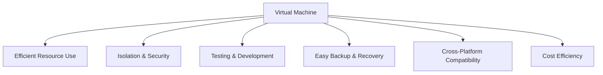

This diagram and explanation make it **clear why VMs are widely used in modern IT, development, and cloud computing**.

# 🐧 What is the Basic Difference Between Rocky and Debian?

| Feature                            | **Rocky Linux**                                          | **Debian**                                                               |
| ---------------------------------- | -------------------------------------------------------- | ------------------------------------------------------------------------ |
| **Type**                           | Enterprise-focused Linux                                 | General-purpose Linux                                                    |
| **Origin**                         | Community-driven fork of RHEL (Red Hat Enterprise Linux) | Independent Linux distribution                                           |
| **Package Management**             | **RPM** packages with **dnf/yum**                        | **DEB** packages with **apt**                                            |
| **Release Model**                  | Stable, enterprise releases (long-term support)          | Stable releases + rolling updates (Debian Stable, Testing, Unstable)     |
| **Target Users**                   | Enterprises, servers, production environments            | General users, servers, desktops, developers                             |
| **Default Init System**            | **systemd**                                              | **systemd** (since Debian 8, previously SysVinit)                        |
| **Community / Commercial Support** | Community-driven, closely compatible with RHEL           | Large community support; used as base for Ubuntu and other distributions |
| **Use Case Example**               | Production servers, cloud environments                   | Desktops, servers, development, education                                |

### Summary in Simple Terms

* **Rocky Linux** = Enterprise-focused, RHEL-compatible, stable for production servers.
* **Debian** = Versatile, stable, widely used for servers and desktops, base for many other distributions.

# What is AppArmor, what's the difference between apt and apptitude?

### What is AppArmor?

**AppArmor** (Application Armor) is a **Linux security module** that helps protect your system by **restricting what applications can do**.

* It works by **enforcing security profiles** for each application.
* Profiles define which files, directories, and capabilities an application can access.
* If an application tries to do something outside its profile, AppArmor **blocks it**, helping prevent damage from bugs or attacks.

**Key Points:**

* Mandatory access control (MAC) system
* Easier to configure than some alternatives (like SELinux)
* Protects against malicious or misbehaving applications

### Difference Between `apt` and `aptitude`

Both `apt` and `aptitude` are **package management tools** used in Debian-based systems, but they have differences:

| Feature                   | **apt**                                                                     | **aptitude**                                                                           |
| ------------------------- | --------------------------------------------------------------------------- | -------------------------------------------------------------------------------------- |
| **Type**                  | Command-line tool for package management                                    | Command-line tool with optional text-based GUI                                         |
| **User Interface**        | CLI only                                                                    | CLI + interactive interface (`aptitude`)                                               |
| **Dependency Resolution** | Resolves dependencies automatically, sometimes asks for manual confirmation | More advanced dependency resolver; can suggest multiple solutions when conflicts occur |
| **Commands**              | `apt install package`, `apt remove package`, `apt update`                   | `aptitude install package`, `aptitude remove package`, `aptitude update`               |
| **Use Case**              | Quick, simple package management                                            | Complex dependency problems, easier package browsing and conflict resolution           |

**In short:**

* `apt` = modern, simple, fast CLI tool for most use cases.
* `aptitude` = advanced tool for handling tricky dependency issues and browsing packages interactively.

# What are partitions, what's their purpose and how to set them up
### What Are Partitions?

A **partition** is a **divided section of a physical storage device** (like a hard disk or SSD) that the operating system treats as a separate “logical” disk.

* A single disk can have **multiple partitions**.
* Each partition can have its own **file system** (ext4, NTFS, FAT32, etc.).
* Partitions help organize data and separate the operating system from user data.

### Purpose of Partitions

Partitions are used to:

1. **Separate System and User Data:**

   * For example, one partition for the OS (`/`) and another for user files (`/home`).

2. **Support Multiple Operating Systems:**

   * Each OS can be installed on a separate partition.

3. **Improve Performance:**

   * Disk operations can be optimized when data is organized into partitions.

4. **Enhance Security and Stability:**

   * If one partition fills up or crashes, other partitions remain unaffected.

5. **Enable Swap Space:**

   * A dedicated swap partition acts as virtual memory when RAM is full.

### How to Set Up Partitions

Partitions can be created during OS installation or on an existing disk using tools like **fdisk, gdisk, parted, or GParted**.

**Steps using `fdisk` (Linux CLI example):**

1. **List Disks:**

   ```bash
   sudo fdisk -l
   ```

2. **Select Disk to Partition:**

   ```bash
   sudo fdisk /dev/sdX
   ```

3. **Create a New Partition:**

   * Type `n` for a new partition.
   * Choose partition type (primary or extended).
   * Set start and end sectors (or accept defaults).

4. **Write Changes:**

   * Type `w` to save changes to the disk.

5. **Format Partition:**

   ```bash
   sudo mkfs.ext4 /dev/sdX1
   ```

6. **Mount Partition:**

   ```bash
   sudo mount /dev/sdX1 /mnt
   ```

Add to `/etc/fstab` to mount automatically at boot.

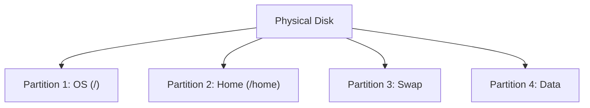

**Explanation:**

* One disk can have multiple partitions.
* Each partition can have a separate purpose (OS, user data, swap, backup).

# How to View the Partitions of the Machine

You can view all the **partitions and disks** on your system using different **Linux commands** or tools.
These show details like disk size, partition type, mount points, and file systems.

#### 🧭 1. Using `lsblk` (Recommended)

```bash
lsblk
```

**Description:**

* Lists all block devices (disks and partitions) in a **tree view**.
* Shows device names, sizes, and mount points.

**Example Output:**

```
NAME   MAJ:MIN RM  SIZE RO TYPE MOUNTPOINT
sda      8:0    0  100G  0 disk
├─sda1   8:1    0   50G  0 part /
├─sda2   8:2    0   45G  0 part /home
└─sda3   8:3    0    5G  0 part [SWAP]
```

#### 🧩 2. Using `fdisk`

```bash
sudo fdisk -l
```

**Description:**

* Displays **detailed information** about all disks and partitions (size, type, filesystem).
* Requires root privileges.

**Example Output:**

```
Device     Boot   Start      End  Sectors  Size Id Type
/dev/sda1  *       2048 1026047  1024000  500M 83 Linux
/dev/sda2       1026048 2097151  1071104  524M 82 Linux swap
```

#### 🧱 3. Using `parted`

```bash
sudo parted -l
```

**Description:**

* Lists partitions and details like partition table type (GPT/MBR).
* Useful for working with large modern disks.

#### 📊 4. Using `df -h`

```bash
df -h
```

**Description:**

* Shows **mounted partitions**, their usage, and available space in human-readable form.

**Example Output:**

```
Filesystem      Size  Used Avail Use% Mounted on
/dev/sda1        50G   20G   30G  40% /
/dev/sda2        45G   10G   35G  4242% /home
```

### 🧠 Summary

| Command     | Purpose                             | Needs Root? | Notes             |
| ----------- | ----------------------------------- | ----------- | ----------------- |
| `lsblk`     | Show disks & partitions (tree view) | No          | Most common       |
| `fdisk -l`  | Detailed partition info             | ✅ Yes       | Classic tool      |
| `parted -l` | GPT/MBR details                     | ✅ Yes       | For modern setups |
| `df -h`     | Mounted partitions & usage          | No          | Shows disk usage  |

# What Are Primary and Logical Partitions?

A **partition** is a section of your physical storage device (like `/dev/sda`) that acts as a separate “container” for data or an operating system.
There are **two main types** of partitions in traditional **MBR (Master Boot Record)** partitioning: **Primary** and **Logical**.

### 🧩 Primary Partition

* A **primary partition** is one of the **main partitions** on a disk.
* The **MBR partition table supports up to 4 primary partitions** only.
* One of these primary partitions can be marked as **active (bootable)** that’s where the operating system usually starts from.
* You **cannot create more than 4 primary partitions** on an MBR disk.

**Example:**
`/dev/sda1`, `/dev/sda2`, `/dev/sda3`, `/dev/sda4`

### 🧱 Logical Partition

* A **logical partition** exists **inside an extended partition** (a special type of primary partition).
* Used to **bypass the 4-partition limit** of MBR.
* You can create **many logical partitions** (like `/dev/sda5`, `/dev/sda6`, etc.).
* Logical partitions are mainly used for **data storage**, **swap**, or **extra OS installations**.

**Example:**

* `/dev/sda1` – Primary (OS)
* `/dev/sda2` – Extended

  * `/dev/sda5` – Logical
  * `/dev/sda6` – Logical

### ⚖️ Differences Between Primary and Logical Partitions

| Feature                  | **Primary Partition**           | **Logical Partition**                    |
| ------------------------ | ------------------------------- | ---------------------------------------- |
| **Maximum Number (MBR)** | Up to 4                         | Unlimited (inside an extended partition) |
| **Bootable**             | Yes (one can be active)         | No (cannot boot directly)                |
| **Location**             | Created directly on disk        | Inside an extended partition             |
| **Typical Use**          | Operating system or boot loader | Extra storage, swap, or additional OS    |
| **Partition Names**      | `/dev/sda1` to `/dev/sda4`      | `/dev/sda5` and above                    |

### 🧠 Modern Note

With modern **GPT (GUID Partition Table)** systems (used by UEFI), the limitation of 4 primary partitions no longer exists
you can create **up to 128 partitions** directly, and the concept of “logical” partitions is obsolete.

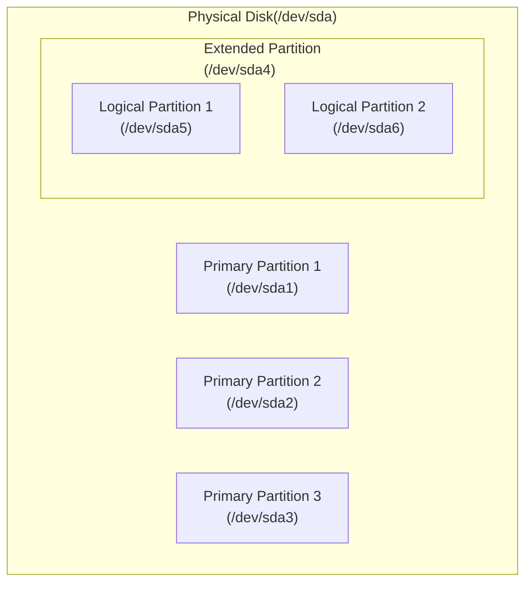

**Explanation:**

* The disk can have up to 4 primary partitions.
* If you need more, one primary is turned into an **extended partition** containing multiple **logical partitions**.

# How LVM works and what it is all about?

### 🧱 What is LVM?

**LVM** stands for **Logical Volume Manager**.
It’s a system for managing disk storage in a **flexible and powerful** way — better than traditional fixed partitions.

Instead of dividing a disk into rigid partitions, LVM allows you to create **logical volumes** that can be **resized, moved, or combined** easily — even while the system is running.

### ⚙️ How LVM Works

LVM introduces **three main layers**:

1. **Physical Volumes (PVs):**

   * These are the actual physical storage devices — like `/dev/sda1`, `/dev/sdb1`, etc.
   * Each PV is initialized with LVM to be used in a volume group.

2. **Volume Groups (VGs):**

   * A volume group is a **pool of storage** created by combining one or more physical volumes.
   * Think of it like a big container made up of multiple disks.

3. **Logical Volumes (LVs):**

   * From the volume group, you create **logical volumes**, which act like virtual partitions.
   * You can format them with a filesystem and mount them like normal disks (e.g., `/home`, `/var`).

### 🧩 Example Workflow

1. You have two disks: `/dev/sda1` and `/dev/sdb1`
2. You convert them into **Physical Volumes (PVs)** using:

   ```bash
   sudo pvcreate /dev/sda1 /dev/sdb1
   ```
3. Combine them into a **Volume Group (VG)**:

   ```bash
   sudo vgcreate vg_data /dev/sda1 /dev/sdb1
   ```
4. Create a **Logical Volume (LV)** inside that VG:

   ```bash
   sudo lvcreate -L 50G -n lv_storage vg_data
   ```
5. Format and mount it:

   ```bash
   sudo mkfs.ext4 /dev/vg_data/lv_storage
   sudo mount /dev/vg_data/lv_storage /mnt/storage
   ```

✅ Now you have one big flexible “virtual disk” that spans multiple physical drives.

### 🪄 Advantages of LVM

| Feature                | Description                                         |
| ---------------------- | --------------------------------------------------- |
| **Flexibility**        | Resize logical volumes easily (extend or shrink).   |
| **Scalability**        | Combine multiple disks into one large storage pool. |
| **Snapshots**          | Create instant backups of live systems.             |
| **Dynamic Management** | Add or remove physical disks without downtime.      |

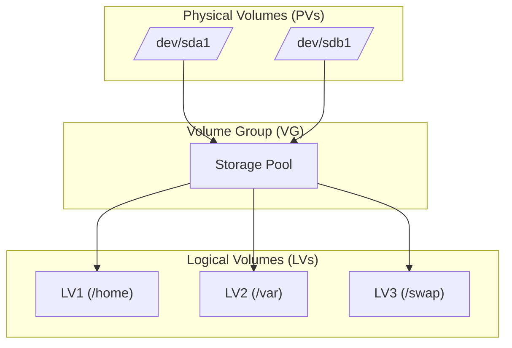

**Explanation:**

* Physical volumes (`/dev/sda1`, `/dev/sdb1`) form the base.
* They are grouped into a **Volume Group (VG)**, which acts as a big storage pool.
* From this pool, you create **Logical Volumes (LVs)** that behave like partitions.

# What is Sudo, why use it and how to set up it's strict rules?

### 🔒 What is `sudo`?

`sudo` stands for **“superuser do”**.
It’s a **Linux command** that allows permitted users to **run commands with elevated (root) privileges** — without logging in as the root user directly.

This means you can perform administrative tasks (like installing software, editing system files, or managing users) securely, while keeping root access **controlled and logged**.

### ⚙️ Why Use `sudo`?

| Reason                   | Description                                                                        |
| ------------------------ | ---------------------------------------------------------------------------------- |
| **Security**             | Users don’t need to log in as `root`; limits risk if their account is compromised. |
| **Accountability**       | Every `sudo` command is logged (who ran it, when, and what).                       |
| **Granular Control**     | Admins can allow specific commands for specific users.                             |
| **Temporary Privileges** | Users gain root access only for a short moment — not permanently.                  |

Example:

```bash
sudo apt update
sudo systemctl restart ssh
```

### 🧠 How `sudo` Works

When you use `sudo`, the system checks a configuration file called `/etc/sudoers`.
That file defines:

* Which users can use `sudo`
* Which commands they can execute
* Whether a password is required

### 🛠️ How to Set Up Strict `sudo` Rules

You can safely edit the `sudo` rules using:

```bash
sudo visudo
```

This opens `/etc/sudoers` in a secure editor and checks for syntax errors before saving.

#### Example: Restrict sudo usage

```bash
# Only allow user 'ayoub' to run specific commands without full root access
ayoub ALL=(ALL:ALL) /usr/bin/apt, /bin/systemctl
```

✅ **Explanation:**

* `ayoub`: username
* `ALL`: applies to all hosts
* `(ALL:ALL)`: can run commands as any user/group
* The list (`/usr/bin/apt`, `/bin/systemctl`) are the **only** allowed commands

#### Example: Force Password Every Time

To make `sudo` ask for a password **every time**:

```bash
Defaults timestamp_timeout=0
```

#### Example: Disable Root Login

To encourage using `sudo` instead of logging in as root:

```bash
sudo passwd -l root
```

### 🧱 Diagram — How `sudo` Works

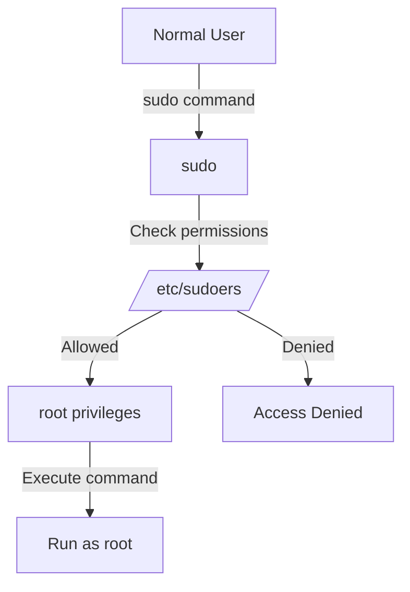

**In summary:**

* `sudo` gives **temporary root powers safely**.
* `/etc/sudoers` defines **who can do what**.
* Setting strict rules increases **security and control**.

# 👤 How to Create a User and Change Its Password

In Linux, user management is an essential part of system administration.
Creating and managing users ensures that each person or service has its own **account, permissions, and security boundaries**.

### 🧩 1. Create a New User

To create a new user, use the `adduser` or `useradd` command.

#### ✅ Recommended Command:

```bash
sudo adduser username
```

**Explanation:**

* `adduser` automatically:

  * Creates the user account
  * Creates a home directory (e.g., `/home/username`)
  * Sets default permissions
  * Prompts you to set a password

💡 Example:

```bash
sudo adduser ayoub
```

This will:

* Create the user **ayoub**
* Create `/home/ayoub`
* Set ownership and permissions
* Ask for a password and optional info (full name, phone, etc.)

### 🧠 Alternative: Using `useradd`

`useradd` is a lower-level command — it needs extra flags:

```bash
sudo useradd -m -s /bin/bash username
```

* `-m`: create home directory
* `-s /bin/bash`: set default shell

Then set the password:

```bash
sudo passwd username
```

Example:

```bash
sudo useradd -m -s /bin/bash ayoub
sudo passwd ayoub
```

### 🔑 2. Change a User’s Password

If you want to **change an existing user’s password**, use:

```bash
sudo passwd username
```

You’ll be prompted to enter and confirm the new password.

💡 Example:

```bash
sudo passwd ayoub
```

### ⚙️ 3. Force Password Change at Next Login

For security, you can require the user to change their password at their next login:

```bash
sudo passwd -e username
```

### 🧱 Diagram — User Creation Process

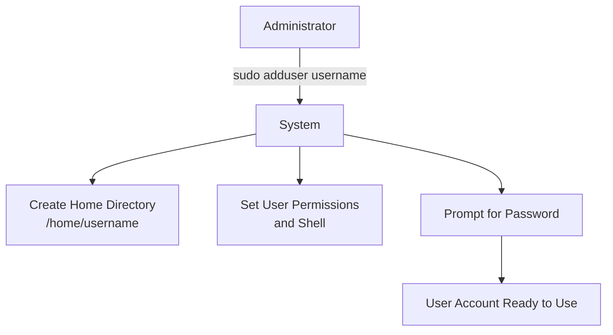

**In summary:**

* Use `adduser` for an easier setup (recommended).
* Use `passwd` to create or change passwords.
* Always manage users with `sudo` for proper permissions.

# 👥 How to Create a Group and Assign Users to It

In Linux, **groups** are used to manage **permissions and access control** for multiple users efficiently.
By assigning users to specific groups, you can easily control who can read, write, or execute certain files or commands.

### 🧩 1. Create a New Group

To create a new group, use the `groupadd` command:

```bash
sudo groupadd groupname
```

💡 Example:

```bash
sudo groupadd developers
```

This creates a new group called **developers**.

### 👤 2. Add a User to a Group

You can assign users to groups in several ways:

#### ✅ Add an Existing User to an Existing Group:

```bash
sudo usermod -aG groupname username
```

* `-aG`: *append* the user to the specified group (don’t forget `-a`)

💡 Example:

```bash
sudo usermod -aG developers ayoub
```

➡️ This adds user **ayoub** to the **developers** group.

#### 🆕 Create a User and Add Them to a Group at the Same Time:

```bash
sudo adduser username groupname
```

💡 Example:

```bash
sudo adduser other_user developers
```

This creates a new user **other_user** and directly adds her to the **developers** group.

---

### 🔍 3. Display All Groups and Users

To list all groups on the system:

```bash
getent group
```

To list all users on the system:

```bash
getent passwd
```

💡 Tip: You can also view groups of the current user with:

```bash
groups
```

### 🧠 4. Remove a User from a Group

If you want to remove a user from a group:

```bash
sudo gpasswd -d username groupname
```

💡 Example:

```bash
sudo gpasswd -d ayoub developers
```

### 🧱 Diagram — User and Group Relationship

```
graph TD
    A[ayoub] --> G1[developers]
    B[other_user] --> G1
    C[admin] --> G2[sudo]
    G1 -->|Access shared files| F[/project folder/]
```

**Explanation:**

* Users `ayoub` and `other_user` are members of the `developers` group.
* The `admin` user is part of the `sudo` group.
* The `developers` group grants access to shared resources.

### ✅ Summary

| Command                               | Description                           |
| ------------------------------------- | ------------------------------------- |
| `sudo groupadd groupname`             | Create a new group                    |
| `sudo adduser username groupname`     | Create a user and add them to a group |
| `sudo usermod -aG groupname username` | Add an existing user to a group       |
| `sudo gpasswd -d username groupname`  | Remove a user from a group            |
| `groups username`                     | Check which groups a user belongs to  |
| `getent group`                        | Display all groups on the system      |
| `getent passwd`                       | Display all users on the system       |

# 🧾 How to Print the Groups a User Is In

To display all the groups a specific user belongs to, use one of the following commands:

| Command           | Description                                                           |
| ----------------- | --------------------------------------------------------------------- |
| `groups username` | Shows all groups that the specified user is a member of               |
| `id username`     | Displays the user ID (UID), group ID (GID), and all group memberships |
| `groups`          | Shows the groups of the **current logged-in user**                    |

💡 **Example:**

```bash
groups ayoub
```

**Output:**

```
ayoub : ayoub developers sudo
```

✅ This means user **ayoub** belongs to the groups **ayoub**, **developers**, and **sudo**.

# 🖥️ How to Change the Hostname of the Machine

The **hostname** is the name that identifies your computer on a network. Changing it can help with **network management, identification, and clarity**.

### 1️⃣ View Current Hostname

```bash
hostname
```

or

```bash
hostnamectl
```

**Example Output:**

```
myserver
```

### 2️⃣ Temporary Change (Until Reboot)

To change the hostname **temporarily** (resets after reboot):

```bash
sudo hostname new-hostname
```

💡 Example:

```bash
sudo hostname myserver01
```

* Works immediately but **does not persist** after a reboot.

### 3️⃣ Permanent Change (Persistent Across Reboots)

#### Using `hostnamectl` (Recommended on modern systems)

```bash
sudo hostnamectl set-hostname new-hostname
```

💡 Example:

```bash
sudo hostnamectl set-hostname myserver01
```

* This updates the **system hostname** permanently.
* To verify:

```bash
hostnamectl
```

#### Optional: Update `/etc/hosts` File

Edit `/etc/hosts` to reflect the new hostname:

```bash
sudo nano /etc/hosts
```

Replace the old hostname with the new one in lines like:

```
127.0.1.1    old-hostname
```

Save the file.

### 4️⃣ Reboot (Optional)

Usually, `hostnamectl` is enough, but you can reboot to ensure all services recognize the new hostname:

```bash
sudo reboot
```

### 🧱 Summary Table

| Action                | Command                                  | Notes                          |
| --------------------- | ---------------------------------------- | ------------------------------ |
| View current hostname | `hostname` or `hostnamectl`              | Displays the machine’s name    |
| Temporary change      | `sudo hostname new-name`                 | Resets after reboot            |
| Permanent change      | `sudo hostnamectl set-hostname new-name` | Persists across reboots        |
| Update hosts file     | Edit `/etc/hosts`                        | Ensures proper name resolution |

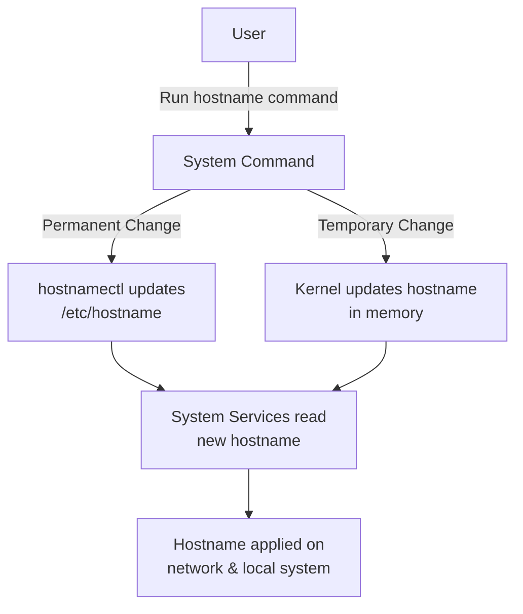

**Explanation:**

* The **user** issues a command (`hostname` or `hostnamectl`).
* **Temporary change:** Kernel updates hostname in memory (lost after reboot).
* **Permanent change:** `hostnamectl` updates `/etc/hostname`, affecting services permanently.
* **Services** read the new hostname so it’s applied across the system and network.

Perfect! Let’s make a **README.md–ready guide** on **creating and setting up a server** in Linux **without going into SSH, firewall, or cron**, since those will be covered later.

# 🖥️ How to Create and Set Up a Server

Setting up a server means preparing a machine (physical or virtual) to **host services, applications, or websites**. This includes installing the OS, configuring essential software, and organizing storage and users.

### 1️⃣ Install the Operating System

1. **Choose a Linux distribution** (Debian, Rocky Linux, Ubuntu Server, etc.).
2. Install it on a **physical server or VM**.

   * Follow the OS installer instructions.
   * Create a **root/admin user** during installation.
   * Optionally, set up **partitions or LVM** for flexible storage.

### 2️⃣ Update the System

Keep your server up to date to ensure **security and stability**:

```bash
sudo apt update && sudo apt upgrade -y   # Debian/Ubuntu
sudo dnf update -y                       # Rocky Linux/CentOS
```

### 3️⃣ Set the Hostname

Give your server a **unique name** for identification on the network:

```bash
sudo hostnamectl set-hostname myserver01
```

### 4️⃣ Create Users and Groups

* Avoid using the root account directly.
* Create administrative and regular users:

```bash
sudo adduser adminuser
sudo usermod -aG sudo adminuser       # Debian/Ubuntu
sudo usermod -aG wheel adminuser      # RHEL/Rocky
```

* Organize users into groups for better **permission management**.

### 5️⃣ Configure Storage

* Check your **partitions**:

```bash
lsblk
```

* Create or mount directories for services or data:

```bash
sudo mkdir /srv/www
sudo chown adminuser:developers /srv/www
```

* Optionally, use **LVM** to create flexible storage volumes.

### 6️⃣ Install Basic Services

Depending on your server purpose, install essential services:

```bash
sudo apt install lighttpd mariadb-server php -y   # Web server example (Debian/Ubuntu)
sudo dnf install lighttpd mariadb-server php -y   # Rocky Linux example
```

* Organize service configuration under `/etc/` (e.g., `/etc/lighttpd/`, `/etc/mysql/`).
* Start and enable services:

```bash
sudo systemctl start lighttpd
sudo systemctl enable lighttpd
```

### 7️⃣ Verify Setup

* Check installed services:

```bash
systemctl status lighttpd
systemctl status mariadb
```

* Verify directories and permissions:

```bash
ls -l /srv/
```

### 🧱 Diagram — Server Setup Workflow

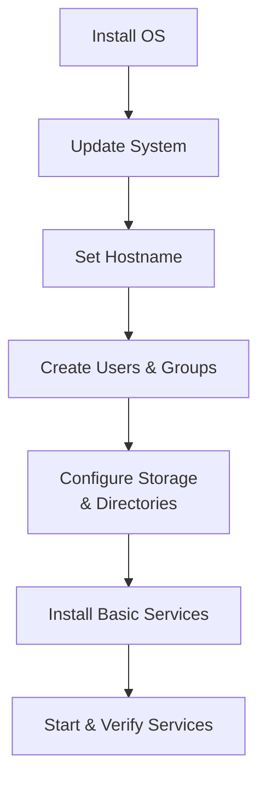

**Explanation:**

* Each step builds on the previous.
* After completion, the server is **ready to host applications or websites**.
* Later, you can secure it with **SSH, firewall, and schedule tasks with cron**.

# What is SSH, how it works and how to set it up?

### 🔒 What is SSH?

**SSH (Secure Shell)** is a protocol used to **securely connect to a remote machine** over a network.
It allows users to **access and manage servers remotely**, transfer files, and execute commands safely.

**Key Features:**

* Encrypted communication (protects against eavesdropping)
* Authentication using passwords or **SSH keys**
* Remote command execution
* Secure file transfer using `scp` or `sftp`

### ⚙️ How SSH Works

1. **Client-Server Model:**

   * The user runs an **SSH client** on their local machine.
   * The remote server runs an **SSH server** (`sshd`).

2. **Connection Establishment:**

   * The client sends a connection request to the server.
   * The server responds with its **public key** for encryption.

3. **Authentication:**

   * The client authenticates using a **password** or **SSH key pair**.

4. **Encrypted Communication:**

   * All commands, file transfers, and data are **encrypted** to ensure privacy and security.

### 🛠️ How to Set Up SSH

#### 1️⃣ Install the SSH Server

**Debian/Ubuntu:**

```bash
sudo apt update
sudo apt install openssh-server -y
```

**Rocky Linux/CentOS:**

```bash
sudo dnf install openssh-server -y
```

#### 2️⃣ Start and Enable SSH Service

```bash
sudo systemctl start ssh      # Ubuntu/Debian
sudo systemctl enable ssh
sudo systemctl status ssh
```

On Rocky Linux/CentOS:

```bash
sudo systemctl start sshd
sudo systemctl enable sshd
sudo systemctl status sshd
```

#### 3️⃣ Connect to a Remote Server

From the client machine:

```bash
ssh username@server_ip
```

**Example:**

```bash
ssh ayoub@192.168.1.10
```

* First connection will prompt to **accept the server’s fingerprint**.
* Enter your **password** or use **SSH keys** for passwordless login.

#### 4️⃣ (Optional) Configure SSH for Security

Edit the SSH configuration file:

```bash
sudo nano /etc/ssh/sshd_config
```

Some common settings:

* Change default port:

```
Port 4242
```

* Disable root login:

```
PermitRootLogin no
```

* Allow only certain users:

```
AllowUsers ayoub adminuser
```

Restart SSH after changes:

```bash
sudo systemctl restart ssh   # or sshd
```

### 🧱 Diagram — How SSH Works

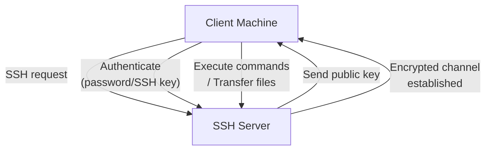

**Explanation:**

* The **client** initiates a connection to the server.
* **Authentication** ensures only authorized users can connect.
* All communication is **encrypted**, keeping commands and data secure.

# What is UFW, how it works and how to set it up?

### 🔥 What is UFW?

**UFW (Uncomplicated Firewall)** is a **user-friendly frontend for managing Linux firewall rules**.
It is designed to **simplify the process of configuring iptables** and securing your server from unauthorized access.

**Key Features:**

* Easy command-line interface
* Enable/disable firewall quickly
* Define rules for **allowing or blocking traffic** by ports, services, or IP addresses
* Works well with IPv4 and IPv6

### ⚙️ How UFW Works

1. **Firewall Rules:**

   * UFW uses **allow** and **deny rules** to control incoming and outgoing traffic.

2. **Profiles & Ports:**

   * Rules can apply to **specific ports** (like 4242 for SSH) or **services** (like HTTP/HTTPS).

3. **Default Policies:**

   * By default, UFW **blocks all incoming traffic** and **allows outgoing traffic** unless specified otherwise.

4. **Activation:**

   * Once rules are defined, UFW enforces them, protecting your server from unwanted access.

### 🛠️ How to Set Up UFW

#### 1️⃣ Install UFW (if not already installed)

**Debian/Ubuntu:**

```bash
sudo apt update
sudo apt install ufw -y
```

**Rocky Linux/CentOS (uses `firewalld` by default, but UFW can be installed):**

```bash
sudo dnf install ufw -y
```

#### 2️⃣ Check UFW Status

```bash
sudo ufw status verbose
```

* Displays if UFW is active and current rules.

#### 3️⃣ Set Default Policies

```bash
sudo ufw default deny incoming
sudo ufw default allow outgoing
```

* Blocks all incoming connections by default
* Allows outgoing connections

#### 4️⃣ Allow Essential Services

Allow traffic for common services like SSH, HTTP, and HTTPS:

```bash
sudo ufw allow 4242      # SSH
sudo ufw allow 80      # HTTP
sudo ufw allow 443     # HTTPS
```

💡 Tip: You can also allow by service name:

```bash
sudo ufw allow OpenSSH
```

#### 5️⃣ Enable UFW

```bash
sudo ufw enable
```

* Activates the firewall
* All defined rules are enforced

#### 6️⃣ Manage Rules

* Delete a rule:

```bash
sudo ufw delete allow 4242
```

* Deny a port:

```bash
sudo ufw deny 8080
```

* Reset all rules:

```bash
sudo ufw reset
```

### 🧱 Diagram — How UFW Works

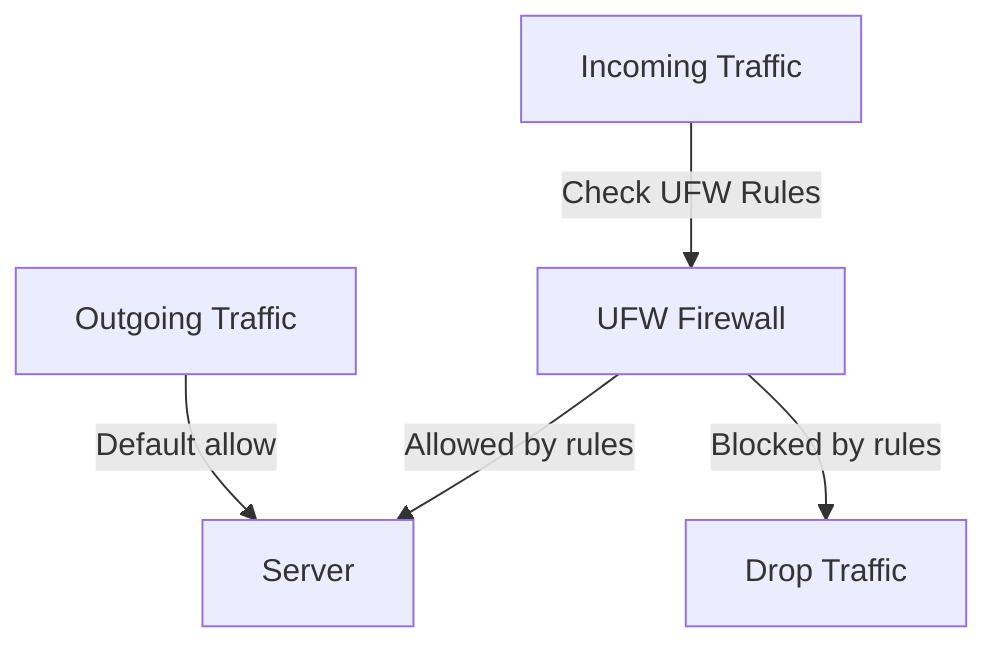

**Explanation:**

* Incoming traffic is checked against **UFW rules**.
* Allowed traffic reaches the server; blocked traffic is dropped.
* Outgoing traffic is typically allowed by default.

# ⏰ What is Cron?

**Cron** is a **time-based job scheduler** in Linux and Unix-like systems.
It allows users and administrators to **automatically run commands or scripts at specified times or intervals** without manual intervention.

**Common Uses:**

* Automating system maintenance tasks (like backups, updates, or log rotation)
* Running scripts at regular intervals (daily, weekly, monthly)
* Scheduling repetitive administrative tasks

### ⚙️ How Cron Works

1. **Cron Daemon (`crond`)**:

   * A background service that constantly runs on the system.
   * Checks for scheduled jobs and executes them at the correct time.

2. **Crontab (Cron Table)**:

   * Each user can have a **crontab file** that contains their scheduled jobs.
   * System-wide cron jobs are usually stored in `/etc/crontab` or `/etc/cron.*` directories.

3. **Job Schedule Syntax:**
   Cron jobs are defined using five time fields plus the command:

```
* * * * * command_to_run
│ │ │ │ │
│ │ │ │ └─ Day of the week (0-7, Sunday=0 or 7)
│ │ │ └── Month (1-12)
│ │ └─── Day of the month (1-31)
│ └──── Hour (0-23)
└───── Minute (0-59)
```

**Example:**
Run a backup script every day at 2:30 AM:

```bash
30 2 * * * /home/ayoub/backup.sh
```

### 🧱 Key Points About Cron

| Feature            | Description                                                                        |
| ------------------ | ---------------------------------------------------------------------------------- |
| **Daemon**         | `crond` runs in the background and executes scheduled jobs                         |
| **User crontab**   | Each user has their own crontab (`crontab -e`)                                     |
| **System crontab** | Located at `/etc/crontab`, can schedule system-level jobs                          |
| **Directories**    | `/etc/cron.daily`, `/etc/cron.hourly`, `/etc/cron.weekly` for predefined schedules |
| **Logging**        | Cron logs activity in `/var/log/cron` or `/var/log/syslog` (depending on distro)   |

### 🧱 Diagram — How Cron Works

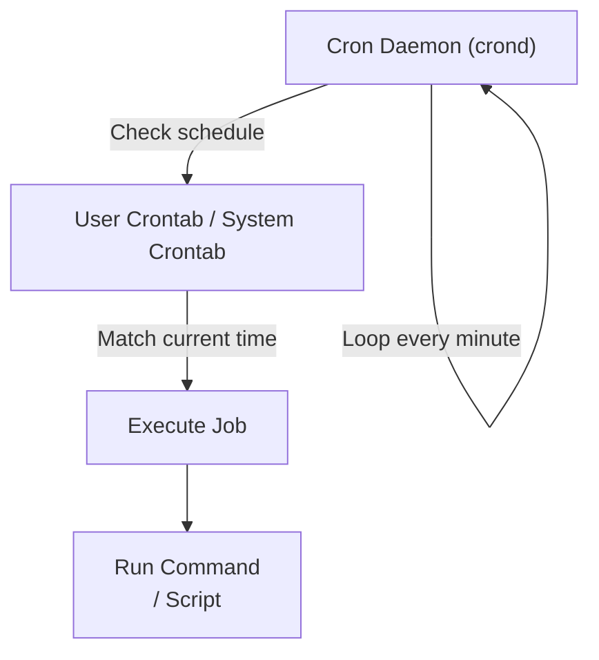

**Explanation:**

* The **cron daemon** continuously checks user and system crontabs.
* When a job’s schedule matches the current time, it is executed automatically.
* Jobs can run scripts, commands, or system maintenance tasks.

## 🧑‍💻 Author

**Ayoub Sadouri**

42 Network – **Born2beRoot Project**

> "A well-configured server isn’t just about running services it’s about reliability, security, and efficiency."

## 📬 Contact

If you’re passionate about **building secure servers, managing Linux systems, or deploying scalable applications**, let’s connect and collaborate!

🌐 [https://ayoubsadouri.com](https://ayoubsadouri.com)

⭐ **Don’t forget to star this repo** if you find it helpful it really motivates me to keep creating guides and tutorials!
